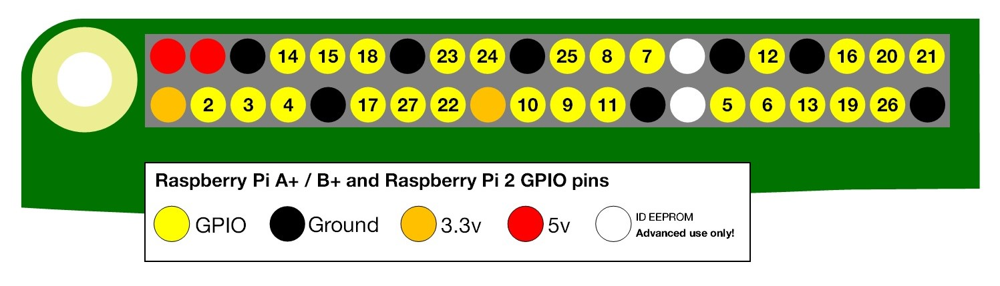

# Digital

Code in this directory demonstrates digital input and output over GPIO pins.

## Setup

sudo apt-get update
sudo apt-get upgrade

sudo apt-get install vim
sudo apt-get install --upgrade RPi.GPIO
sudo apt-get install git

## Pins

Set up the breadboard to reflect the image in image1.
Connect the red wire to a 3.3V power pin.
Connect the blue wire to a GPIO pin 19.

A different GPIO pin can be used, but it must be intialized in the python code.

Image1

src: http://razzpisampler.oreilly.com/ch07.html

GPIO pins for pi

