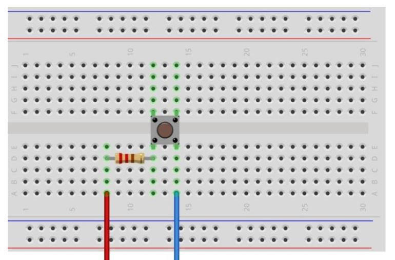
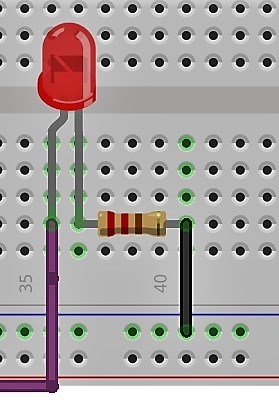

# Digital

Code in this directory demonstrates digital input and output over GPIO pins.

## Setup

sudo apt-get update

sudo apt-get upgrade

sudo apt-get install vim

sudo apt-get install --upgrade RPi.GPIO

sudo apt-get install git

## Pins

Set up the breadboard to reflect the image in image1.
Connect the red wire to a 3.3V power pin.
Connect the blue wire to a GPIO pin 19.

A different GPIO pin can be used, but it must be intialized in the python code.

We then can connect an led to go off when the button is pressed.

Connect the led as shown in image 2. The purple wire goes to the GPIO output pin chosen in the code. This is pin24 for our python program. The black wire is connected to ground. Make sure to have the resistor in otherwise the led will break.

Image1

http://razzpisampler.oreilly.com/ch07.html

Image2

https://www.hackster.io/hardikrathod/push-button-with-raspberry-pi-6b6928

GPIO pins for pi

